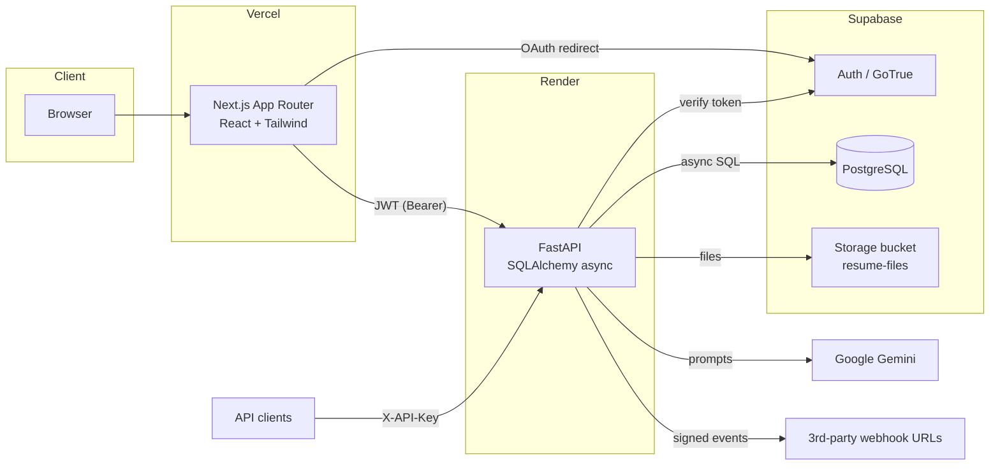

# Architecture

## Overview

ResumeAI Pro is a three-tier app: a **Next.js frontend**, a **FastAPI backend**,
and **Supabase** (Auth + Postgres + Storage). Google **Gemini** provides AI, with
graceful non-AI fallbacks everywhere so features degrade instead of breaking.



## Tech stack

| Layer | Tech |
|---|---|
| Frontend | Next.js 14 (App Router), React 18, TypeScript, Tailwind CSS (custom design system), Zustand, `@supabase/supabase-js` (OAuth only) |
| Backend | FastAPI, SQLAlchemy 2 (async), Pydantic v2, uvicorn |
| Data | Supabase PostgreSQL (session pooler), local SQLite fallback for dev |
| Auth | Supabase Auth (email/password + Google/GitHub OAuth); backend verifies JWTs and mirrors identities into `profiles` |
| AI | Google Gemini `gemini-2.0-flash-lite` (primary), OpenAI (fallback), deterministic fallbacks last |
| Storage | Supabase Storage (private `resume-files` bucket, per-user folders, signed URLs) |
| Hosting | Vercel (frontend), Render (backend), Supabase (managed data) |

## Auth model
- **Identity** is owned by Supabase Auth. Email/password flows go through the backend
  (`/api/auth/*` using the Supabase admin API); Google/GitHub use client-side
  `supabase-js` → redirect to `/auth/callback` → backend `/api/auth/me` sync.
- Every authenticated request carries the Supabase JWT as `Authorization: Bearer`.
  `services/deps.get_current_user` verifies it, **mirrors the user into `profiles`**
  (auto-creating on first sight, assigning `admin` if the email is in `ADMIN_EMAILS`),
  and returns the DB user with its `role`.
- **Programmatic access**: `/api/v1/*` authenticates with an `X-API-Key` header
  (hashed keys, per-key rate limit). See [API.md](./API.md).
- A `401` from any call triggers a client-side session clear + redirect to login.

## Request flow (example: save a resume)
1. Browser `PUT /api/resumes/{id}` with Bearer JWT.
2. `get_current_user` verifies the token (Supabase), loads the `profiles` row.
3. Router decomposes the nested `content` object into normalized child rows
   (experiences, education, skills, …) via the **content adapter**.
4. A throttled **version snapshot** is written (`resume_versions`).
5. Async commit → response.
6. Best-effort side-effects fire in the background: **webhook dispatch**
   (`resume.updated`) and **audit log** (`resume.update`).

## Content adapter (key design decision)
The frontend works with a single nested `content` object; the DB stores each
resume section in its own **normalized table**. `routers/resumes.py` translates:
`_to_content()` assembles the object on read, `_apply_content()` decomposes it on
write. This keeps the UI simple while the data stays queryable/indexed.

## Cross-cutting services (`backend/services/`)
| Service | Responsibility |
|---|---|
| `deps.py` | `get_current_user`, `require_admin` (auth + RBAC) |
| `auth.py` | Supabase signup/login/verify (+ demo fallback) |
| `ai.py` | Gemini/OpenAI calls + all AI features, robust JSON parsing, fallbacks |
| `ats.py` | Keyword ATS scoring + no-JD "resume analysis" |
| `parsing.py` | PDF/DOCX/TXT text extraction |
| `storage.py` | Supabase Storage bucket + upload/signed-URL/list/delete |
| `apikeys.py` | API key generation/hashing + `X-API-Key` auth + rate limit |
| `webhooks.py` | Background event dispatch, HMAC signing, retries, delivery logs |
| `usage.py` | AI token/cost accounting (contextvar + background write) |
| `audit.py` | Background audit-log writes |

## Folder structure
```
resumeai-pro/
├─ frontend/                 # Next.js App Router
│  ├─ app/
│  │  ├─ dashboard/          # Next Best Action, stats, activity
│  │  ├─ resumes/[id]/edit/  # editor: sections, preview, ATS, skill-gap, history
│  │  ├─ ai-upgrade/         # 5-step upload→enhance→compare→save
│  │  ├─ job-match/          # resume ↔ JD matching
│  │  ├─ job-tracker/        # Kanban application tracker
│  │  ├─ interview-questions/, cover-letters/, templates/, ai-writer/,
│  │  ├─ ats-checker/, admin/, settings/, auth/{login,signup,callback}/
│  ├─ components/            # Sidebar, AppShell, CircularScore, ResumeTemplates,
│  │  └─ VersionHistory, OAuthButtons, ui/…
│  └─ lib/                   # api.ts, store.ts (Zustand), supabaseClient.ts, skillsData.ts
│
├─ backend/                  # FastAPI
│  ├─ main.py                # app, CORS, lifespan (init_db + bucket), router registration
│  ├─ database.py            # engine (Supabase Postgres or SQLite), get_db, init_db
│  ├─ models.py              # all SQLAlchemy models (see DATABASE.md)
│  ├─ routers/               # auth, resumes, ai, ats, export, cover_letters, billing,
│  │                         #   upgrade, applications, storage, keys, v1, webhooks, admin
│  └─ services/              # see table above
│
├─ supabase/migrations/      # SQL schema + RLS
└─ docs/                     # this folder
```

## Resilience principles
- **AI never hard-fails**: Gemini → OpenAI → deterministic fallback (bullets,
  summaries, questions, skills all have templated fallbacks).
- **Side-effects are best-effort**: webhooks, audit, token-tracking, and storage
  run in the background and never break the primary request.
- **DB flexibility**: real Postgres when `DATABASE_URL` has a password, else SQLite —
  same code path, tables auto-created on startup via `create_all`.
