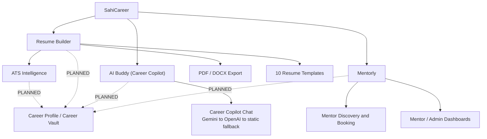
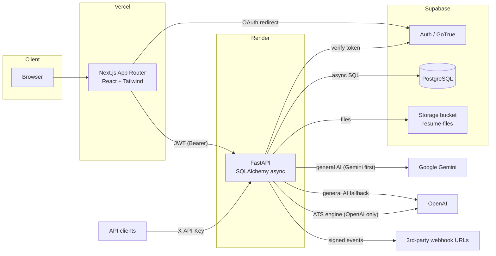
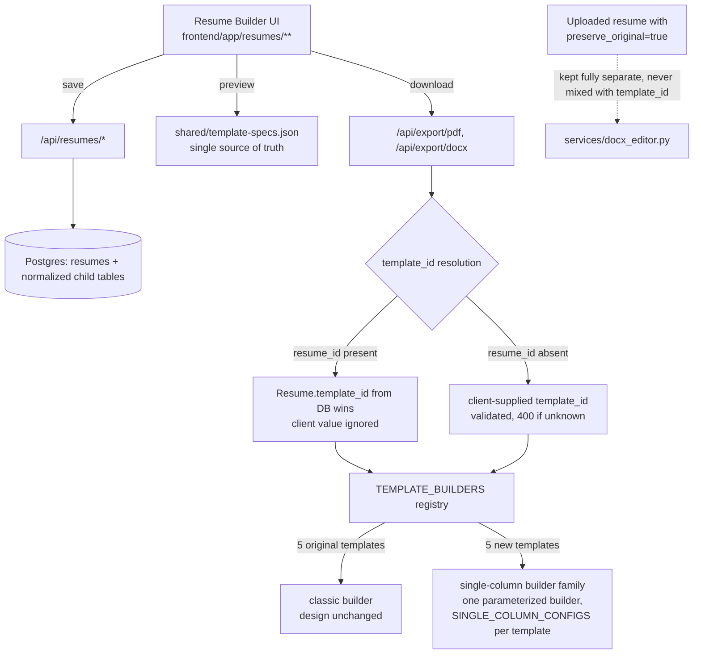
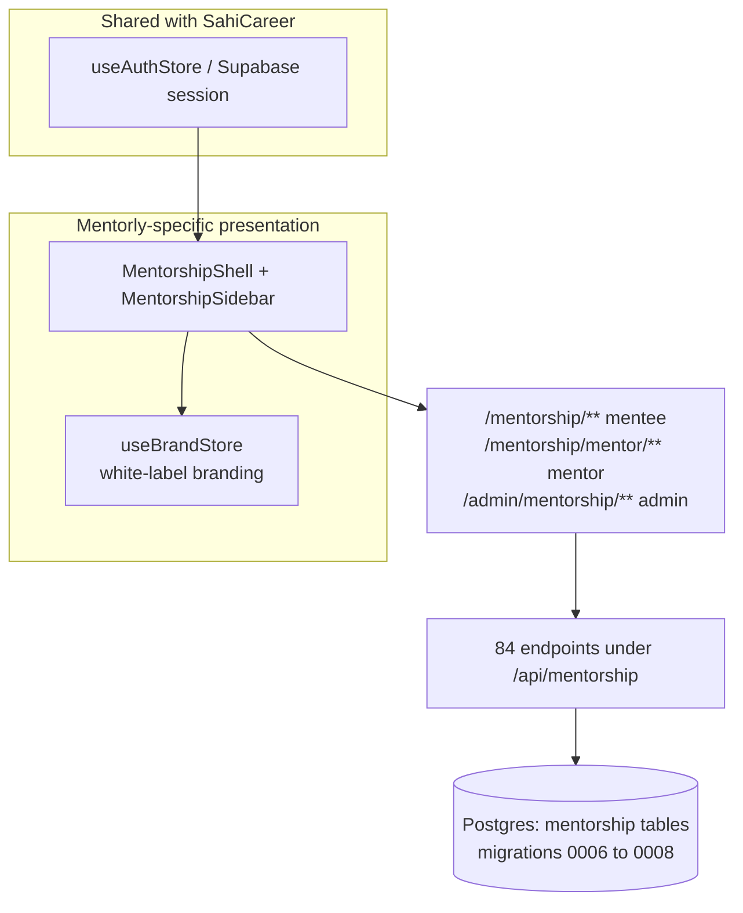

# Architecture

**Status of this document:** this file existed before this documentation pass (it originally described the pre-Mentorship, pre-Phase-1/2/3 state of the project). It has been **updated in place** — the original's accurate structural sections (content adapter, folder structure, resilience principles) are preserved and corrected where stale; new sections cover what's been added since (Mentorly, the ten-template export architecture, ATS Intelligence's Match/Completeness/Confidence model, and the still-planned Career Profile). Where something is planned but not built, it is explicitly marked and cross-linked to the relevant `PHASE_*.md`. See [AI_DEVELOPMENT_LOG.md](AI_DEVELOPMENT_LOG.md) for how and when each part was built, and [API.md](API.md) / [DATABASE.md](DATABASE.md) / [DEVELOPER_GUIDE.md](DEVELOPER_GUIDE.md) / [WEBHOOKS.md](WEBHOOKS.md) for the companion documents this one intentionally does not duplicate.

---

## 1. Overview

SahiCareer ("ResumeAI Pro" in some older internal docs/URLs) is a three-tier app: a **Next.js frontend**, a **FastAPI backend**, and **Supabase** (Auth + Postgres + Storage), plus two independent AI integrations (Google Gemini and OpenAI — see §7). AI never hard-fails: every AI-backed feature has a deterministic fallback so it degrades instead of breaking.


```mermaid
flowchart TD
    A[SahiCareer] --> B[Resume Builder]
    A --> C["AI Buddy (Career Copilot)"]
    A --> D[Mentorly]
    B --> E[ATS Intelligence]
    B --> F[PDF / DOCX Export]
    B --> G[10 Resume Templates]
    C --> H["Career Copilot Chat<br/>Gemini to OpenAI to static fallback"]
    D --> I[Mentor Discovery and Booking]
    D --> J[Mentor / Admin Dashboards]
    E -.->|PLANNED| K[Career Profile / Career Vault]
    B -.->|PLANNED| K
    C -.->|PLANNED| K
    D -.->|PLANNED| K
```

**Today, Resume Builder, AI Buddy, and Mentorly are one Next.js application and one FastAPI backend, sharing one authentication session — not three separate systems.** See §4.


```mermaid
flowchart LR
    subgraph Client
      B[Browser]
    end
    subgraph Vercel
      FE["Next.js App Router<br/>React + Tailwind"]
    end
    subgraph Render
      API["FastAPI<br/>SQLAlchemy async"]
    end
    subgraph Supabase
      AUTH[Auth / GoTrue]
      DB[(PostgreSQL)]
      ST["Storage bucket<br/>resume-files"]
    end
    GEM[Google Gemini]
    OAI[OpenAI]
    EXT[3rd-party webhook URLs]

    B --> FE
    FE -->|"JWT (Bearer)"| API
    FE -->|OAuth redirect| AUTH
    API -->|verify token| AUTH
    API -->|async SQL| DB
    API -->|files| ST
    API -->|"general AI (Gemini first)"| GEM
    API -->|"general AI fallback"| OAI
    API -->|"ATS engine (OpenAI only)"| OAI
    API -->|signed events| EXT
    Ext2[API clients] -->|X-API-Key| API
```

## 2. Tech stack

| Layer | Tech | Confirmed |
|---|---|---|
| Frontend | Next.js `14.2.3` (App Router), React `^18`, TypeScript, Tailwind CSS (custom design system), Zustand `^4.5.2`, `@supabase/supabase-js ^2.43.4` (OAuth only) | ✅ |
| Backend | FastAPI `0.111.0`, SQLAlchemy 2 (async), Pydantic v2, uvicorn | ✅ |
| Data | Supabase PostgreSQL (session pooler) — one shared project for local dev and production | ✅ |
| Auth | Supabase Auth (email/password + Google/GitHub OAuth); backend verifies JWTs and mirrors identities into the `users`/`profiles` table | ✅ |
| AI — general features | Google Gemini (primary) → OpenAI GPT-4o-mini (fallback) → deterministic static fallback (last resort) — `services/ai.py` | ✅ |
| AI — ATS engine specifically | OpenAI only (`chat.completions`, `embeddings`) — `services/ats_engine/llm.py`, a **separate** integration from the above | ✅ — see §7 |
| Storage | Supabase Storage (private `resume-files` bucket, per-user folders, signed URLs) | ✅ |
| Payments | Stripe (`checkout.Session`, webhook-verified) | ✅ |
| Hosting | Vercel (frontend), Render (backend), Supabase (managed data) | Backend confirmed live; Vercel not independently re-confirmed in the most recent session — see [AI_DEVELOPMENT_LOG.md](AI_DEVELOPMENT_LOG.md) Entry 12 |

## 3. Auth model

- **Identity** is owned by Supabase Auth. Email/password flows go through the backend (`/api/auth/*`, using the Supabase admin API); Google/GitHub use client-side `supabase-js` → redirect to `/auth/callback` → backend `/api/auth/me` sync.
- Every authenticated request carries the Supabase JWT as `Authorization: Bearer`. `services/deps.py::get_current_user` verifies it, **mirrors the user into the local `users` table** (auto-creating on first sight, assigning the `admin` role if the email is in `ADMIN_EMAILS`), and returns the DB user with its `role`.
- **A second, older auth-resolution path also exists and is still in active use**: `services/auth.py::verify_token` returns the *raw* Supabase SDK user object (`.id` is a `str`), used by `backend/routers/export.py`'s own `_auth` dependency and by the legacy `services/ats.py` callers — versus `get_current_user`'s ORM row (`.id` is a `uuid.UUID`). Comparing the two without normalizing to the same type has caused a real ownership-check bug before (see the explicit code comment in `export.py::_resolve_template_id`, which now string-normalizes both sides specifically because of this). New endpoints should default to `get_current_user`.
- **Programmatic access**: `/api/v1/*` authenticates with an `X-API-Key` header (hashed keys, per-key rate limit) — see [API.md](API.md).
- A `401` from any call triggers a client-side session clear + redirect to login.
- **No Next.js `middleware.ts` exists anywhere in `frontend/`** — confirmed absent. All frontend route protection is client-side, duplicated (not shared) across two guard components: `AppShell` (Resume Builder + AI Buddy) and `MentorshipShell` (Mentorly). See [PHASE_4_SAHICAREER_AUTH_AND_SERVICES.md](PHASE_4_SAHICAREER_AUTH_AND_SERVICES.md) — the post-login default-landing logic (`frontend/lib/authRedirect.ts`) previously sent every plain user to Mentorly instead of the SahiCareer dashboard after login; this has been fixed (uncommitted as of this writing).

## 4. Request flow (example: save a resume)

1. Browser `PUT /api/resumes/{id}` with Bearer JWT.
2. `get_current_user` verifies the token (Supabase), loads the local user row.
3. Router decomposes the nested `content` object into normalized child rows (experiences, education, skills, projects, certifications, languages, achievements, interests) via the **content adapter** (§5).
4. A throttled **version snapshot** is written (`resume_versions`).
5. Async commit → response.
6. Best-effort side-effects fire in the background: **webhook dispatch** (`resume.updated`) and **audit log** (`resume.update`).

## 5. Content adapter (key design decision)

The frontend works with a single nested `content` object; the DB stores each resume section in its own **normalized table**. `routers/resumes.py` translates: `_to_content()` assembles the object on read, `_apply_content()` decomposes it on write. This keeps the UI simple while the data stays queryable/indexed. **This same normalized shape is what `routers/ats_engine.py::_resume_to_content()` reads directly for saved-resume ATS analysis** (no re-parsing needed — see §8) — confirmed to include `personalInfo`, `summary`, `experience`, `education`, `skills`, `projects`, `certifications`, `languages`, `achievements`, `interests` as of this session's Phase 3 work (the last three were a bugfix in that same session — they were previously silently dropped for saved-resume ATS analysis).

## 6. Resume Builder, Templates, PDF/DOCX Export


```mermaid
flowchart TD
    RB["Resume Builder UI<br/>frontend/app/resumes/**"] -->|save| API["/api/resumes/*"]
    API --> DB[(Postgres: resumes + normalized child tables)]
    RB -->|preview| SPECS["shared/template-specs.json<br/>single source of truth"]
    RB -->|download| EXPORT["/api/export/pdf, /api/export/docx"]
    EXPORT --> RESOLVE{template_id resolution}
    RESOLVE -->|resume_id present| DBID["Resume.template_id from DB wins<br/>client value ignored"]
    RESOLVE -->|resume_id absent| CLIENT["client-supplied template_id<br/>validated, 400 if unknown"]
    DBID --> BUILDERS[TEMPLATE_BUILDERS registry]
    CLIENT --> BUILDERS
    BUILDERS -->|5 original templates| CLASSIC["classic builder<br/>design unchanged"]
    BUILDERS -->|5 new templates| SINGLECOL["single-column builder family<br/>one parameterized builder,<br/>SINGLE_COLUMN_CONFIGS per template"]
    UPLOAD["Uploaded resume with<br/>preserve_original=true"] -.->|kept fully separate, never mixed with template_id| DOCXEDIT[services/docx_editor.py]
```

Ten templates total: Modern, Professional, Minimal, Creative, Executive (pre-existing, design unchanged) plus Tech Stack, Career Starter, Academic, Healthcare Pro, Global Professional (new). No headless-browser rendering is used anywhere in this pipeline — a deliberate choice (AGPL/licensing and infra-cost concerns). Full detail: [PHASE_1_TEMPLATE_FOUNDATION.md](PHASE_1_TEMPLATE_FOUNDATION.md), [PHASE_2_RESUME_TEMPLATES.md](PHASE_2_RESUME_TEMPLATES.md).

## 7. ATS Intelligence


```mermaid
flowchart TD
    UI["/ats-checker"] -->|resume_id + target_role/JD| EP["POST /api/ats/v2/analyze-resume"]
    EP --> PARSE{Resume source}
    PARSE -->|saved resume| FROMCONTENT["ResumeParser.from_content&#40;&#41;<br/>no re-parsing, reads DB directly"]
    PARSE -->|pasted/uploaded text| AIPARSE["ResumeParser.parse&#40;&#41;<br/>LLM, heuristic fallback"]
    EP --> JOBPARSE["JobParser.parse&#40;&#41; or<br/>role_profiles library, no-JD mode"]
    FROMCONTENT --> SCORING["scoring.py:<br/>Match / Completeness / Confidence<br/>per category, dynamic weight redistribution"]
    AIPARSE --> SCORING
    JOBPARSE --> SCORING
    SCORING --> PERSIST["AtsReport row<br/>extended, not a new table"]
    PERSIST --> HISTORY["GET /api/ats/v2/history/&#123;resume_id&#125;"]
    SCORING -->|chat_json / embed_text| LLM["services/ats_engine/llm.py<br/>OpenAI only"]
    LLM -.->|429 / unavailable| DEGRADE["Deterministic scoring still completes<br/>confirmed live in production testing"]
```

**Two ATS implementations exist by design, not accident:** `services/ats_engine/` (canonical — everything above) and the older `services/ats.py` (legacy, frozen — still backs three specific frontend pages that depend on its exact response shape: `ai-upgrade`, the resume editor, `job-match`). See [PHASE_3_ATS_INTELLIGENCE.md](PHASE_3_ATS_INTELLIGENCE.md) for the full model, including the two verified examples proving missing candidate data is never auto-scored as zero.

**Two separate AI/LLM integrations exist in this codebase — do not conflate them:**

| Module | Provider chain | Used by |
|---|---|---|
| `services/ats_engine/llm.py` | OpenAI only (`OPENAI_API_KEY`) | ATS engine exclusively |
| `services/ai.py` | Gemini (primary) → OpenAI (fallback) → static fallback (last resort) | Everything else — Career Copilot chat, bullet/summary generation, cover letters, interview questions, skill-gap, translation |

## 8. AI Buddy

`/copilot` ("Career Copilot") is a chat interface backed by `services/ai.py::career_copilot()` — Gemini-first, with a lightweight profile context auto-built from the user's most recent resume, and a confirmed graceful static fallback (flagged `ai: false` to the frontend) when no AI provider responds. Several other AI-assisted tools exist elsewhere in the app (bullet/summary generation, interview questions, skill-gap) but are not unified under one "AI Buddy" product surface yet. See [PHASE_5_AI_BUDDY.md](PHASE_5_AI_BUDDY.md).

## 9. Mentorly


```mermaid
flowchart TD
    subgraph "Shared with SahiCareer"
        AUTH[useAuthStore / Supabase session]
    end
    subgraph "Mentorly-specific presentation"
        SHELL[MentorshipShell + MentorshipSidebar]
        BRAND["useBrandStore<br/>white-label branding"]
    end
    AUTH --> SHELL
    SHELL --> BRAND
    SHELL --> PAGES["/mentorship/** mentee<br/>/mentorship/mentor/** mentor<br/>/admin/mentorship/** admin"]
    PAGES --> API["84 endpoints under /api/mentorship"]
    API --> DB[(Postgres: mentorship tables<br/>migrations 0006 to 0008)]
```

**Same application, same domain, same login — separate navigation shell and optional white-label branding only, no separate auth system.** Covers mentor discovery, booking (with session types including `mock_interview` and `resume_review` as first-class types), career goals, mentor/admin dashboards, programs, events, notifications, and platform feedback. See [PHASE_6_MENTORLY.md](PHASE_6_MENTORLY.md) — including a noted provenance caveat (Mentorly's original development predates any transcript available to this documentation pass) and a real test-coverage gap (no tests exist for this module).

## 10. Career Profile — PLANNED

No unified, user-scoped Career Profile exists today. The closest things are (a) each `Resume.content` blob (§5), scoped per-resume rather than per-user, and (b) the narrower EduBridge `career_record` (`/api/career-record`, education/training/certificates only, sourced from EduBridge's own LMS/college systems). Neither is wired to feed Resume Builder, AI Buddy, ATS, or Mentorly from one shared source today. See [PHASE_7_CAREER_PROFILE.md](PHASE_7_CAREER_PROFILE.md) for the full gap analysis.

## 11. Cross-cutting services (`backend/services/`)

| Service | Responsibility |
|---|---|
| `deps.py` | `get_current_user`, `require_admin` (auth + RBAC) — the canonical auth path |
| `auth.py` | Supabase signup/login/verify (+ demo fallback); also the source of the *second*, older `verify_token` auth path (§3) |
| `ai.py` | Gemini/OpenAI calls for general AI features, robust JSON parsing, deterministic fallbacks |
| `ats.py` | **Legacy, frozen** — keyword-overlap ATS scoring + no-JD "resume analysis"; still backs 3 live pages, not extended further |
| `ats_engine/` | **Canonical ATS engine** (package) — parsing, keyword/skill/similarity matching, Match/Completeness/Confidence scoring, recommendations, tailoring. Its own `llm.py` is OpenAI-only, separate from `ai.py` |
| `mentorship.py` | All Mentorly business logic (~2100 lines, 84 endpoints' worth of logic) |
| `events.py`, `programs.py`, `tasks.py`, `platform_feedback.py`, `privacy_requests.py` | Mentorly-adjacent supporting features |
| `career.py` | Backs `/api/career-record` (EduBridge-verified education/training/certificate ingestion) |
| `roles.py` | `role_profiles` library (115 roles) — used by ATS role-based analysis and elsewhere |
| `skill_categories.py` | Heuristic skill-category grouping for the Tech Stack template's PDF/DOCX rendering (mirrored by hand in `frontend/lib/skillCategories.ts`) |
| `parsing.py` | PDF/DOCX/TXT text extraction |
| `docx_editor.py` | The `preserve_original` uploaded-resume design-preservation workflow (kept separate from `template_id` rendering — §6) |
| `storage.py` | Supabase Storage bucket + upload/signed-URL/list/delete |
| `apikeys.py` | API key generation/hashing + `X-API-Key` auth + rate limit |
| `webhooks.py` | Background event dispatch, HMAC signing, retries, delivery logs |
| `usage.py` | AI token/cost accounting and usage-event tracking (`log_usage_event`, `record_usage`) — no credit-blocking/paywall enforcement exists yet |
| `audit.py` | Background audit-log writes |
| `voice.py`, `writing.py`, `metrics.py`, `grammar.py` | Needs verification of exact scope — present in the codebase but not inspected in detail for this document |

## 12. Folder structure

```
resumeAI/
├─ frontend/                       # Next.js App Router
│  ├─ app/
│  │  ├─ dashboard/                # SahiCareer dashboard (Resume Builder-centric today — see Phase 4)
│  │  ├─ resumes/[id]/edit/        # editor: sections, preview, ATS, skill-gap, history
│  │  ├─ resumes/build/            # role-guided resume creation
│  │  ├─ ai-upgrade/               # 5-step upload→enhance→compare→save (legacy ATS engine)
│  │  ├─ copilot/                  # AI Buddy chat ("Career Copilot")
│  │  ├─ job-match/, job-tracker/, interview-questions/, cover-letters/,
│  │  │  templates/, ai-writer/, ats-checker/, admin/, settings/,
│  │  │  auth/{login,signup,callback}/
│  │  ├─ mentorship/**             # Mentorly — mentee + mentor sub-routes
│  │  └─ admin/mentorship/**       # Mentorly admin console
│  ├─ components/                  # Sidebar, AppShell, CircularScore, ResumeTemplates,
│  │  ├─ templates/                # the 5 new Phase 2 React template components
│  │  ├─ mentorship/                # MentorshipShell, MentorshipSidebar, AdminMentorshipShell, etc.
│  │  └─ ats/                      # PillList, ScoreBar (ATS dashboard building blocks)
│  └─ lib/                         # api.ts, store.ts (Zustand), authRedirect.ts, brandStore.ts, supabaseClient.ts, skillCategories.ts
│
├─ backend/                        # FastAPI
│  ├─ main.py                      # app, CORS, lifespan (init_db + bucket), router registration
│  ├─ database.py                  # engine (Supabase Postgres), get_db, init_db
│  ├─ models.py                    # all SQLAlchemy models (see DATABASE.md)
│  ├─ routers/                     # auth, resumes, ai, ats, ats_engine, mentorship, export,
│  │                                #   cover_letters, billing, upgrade, applications, storage,
│  │                                #   keys, v1, webhooks, admin, roles, career_record, voice, writing, metrics
│  └─ services/                    # see §11
│
├─ shared/
│  └─ template-specs.json          # single source of truth for template metadata (frontend + backend both read this)
│
├─ supabase/migrations/            # SQL schema + RLS (0001 through 0010 as of this writing)
└─ docs/                           # this folder
```

## 13. Resilience principles

- **AI never hard-fails**: Gemini → OpenAI → deterministic fallback for general features (bullets, summaries, questions, skills all have templated fallbacks); the ATS engine's OpenAI-only path degrades to deterministic scoring when unavailable (confirmed live — see [PHASE_3_ATS_INTELLIGENCE.md](PHASE_3_ATS_INTELLIGENCE.md)).
- **Side-effects are best-effort**: webhooks, audit, token-tracking, and storage run in the background and never break the primary request.
- **No headless-browser dependency** anywhere in the export pipeline — a deliberate architectural constraint, not an oversight (see [PHASE_1_TEMPLATE_FOUNDATION.md](PHASE_1_TEMPLATE_FOUNDATION.md) §3).

## 14. External integrations

| Integration | Purpose | Confirmed |
|---|---|---|
| Supabase Auth | Identity provider | ✅ |
| Supabase Postgres | Primary database | ✅ |
| Supabase Storage | Private file storage for uploads | ✅ |
| OpenAI (`chat.completions`, `embeddings`) | ATS engine's LLM layer | ✅ |
| Google Gemini | General AI features (Copilot, bullet/summary generation, etc.), first in the fallback chain | ✅ |
| Stripe | Billing/subscriptions (`checkout.Session`, webhook-verified) | ✅ — note: ATS usage tracking (Phase 3) deliberately does not enforce any subscription/credit block yet, even though Stripe billing exists elsewhere |
| GitHub Actions | CI (`ci.yml`: backend pytest + coverage, frontend lint/typecheck/build) and a keep-alive cron (`keepalive.yml`, pings Render's `/health` every 10 minutes) | ✅ |
| Render | Backend hosting, auto-deploys from `main` | ✅ |
| Vercel | Frontend hosting, auto-deploys from `main` (per `DEPLOYMENT.md`) | Not independently re-confirmed live in the most recent session |

## 15. Known cross-cutting risks

1. **Dual backend auth-resolution paths** (`get_current_user` vs. `verify_token`) — §3. Has caused at least one real bug already.
2. ~~**Post-login default redirect defect**~~ — **fixed** (uncommitted). Every plain user previously landed on Mentorly instead of the SahiCareer dashboard after login. See [PHASE_4_SAHICAREER_AUTH_AND_SERVICES.md](PHASE_4_SAHICAREER_AUTH_AND_SERVICES.md) for what changed, including a related bug found during verification (`/resumes/build`'s own guard also dropped deep links).
3. **Manual section-parity sync** between each new resume template's React component and its PDF/DOCX builder config — no automated enforcement. See [PHASE_2_RESUME_TEMPLATES.md](PHASE_2_RESUME_TEMPLATES.md) §5.
4. **A page can be silently `.gitignore`d out of production** — has happened at least once before (`/resumes/build`, fixed in commit `e23b59d`). Worth a periodic sanity check that every route under `frontend/app/` is actually tracked in git.
5. **No test coverage for the Mentorly module** (`services/mentorship.py`/`routers/mentorship.py`, 84 endpoints).
6. **Frontend production deploy (Vercel) is not independently monitorable** from within a Claude Code session — no CLI/API credentials are available; deploy success has to be manually confirmed by the project owner.
7. **`skill_categories.py` (Python) and `skillCategories.ts` (TypeScript) are two hand-maintained copies of the same keyword map** — a drift risk similar to §3 above, specific to the Tech Stack template.

## 16. How to keep this document accurate

Update it when the architecture actually changes (a new router, a new external integration, a resolved cross-cutting risk) — not on a fixed schedule. If a diagram or claim can't be verified by reading the current code, mark it `Needs verification` rather than stating it as fact. See [AI_DEVELOPMENT_LOG.md](AI_DEVELOPMENT_LOG.md) for the same discipline applied to the change history.
