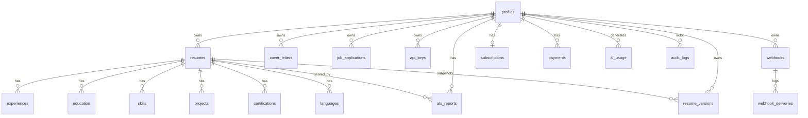

# Database

PostgreSQL (Supabase) in production; SQLite locally when `DATABASE_URL` is unset.
Models live in `backend/models.py`. `profiles.id` equals the Supabase `auth.users` id.

## ER diagram

## Core tables

### profiles
1:1 with Supabase `auth.users`. The app's user record.
`id, email, full_name, avatar_url, role (user|admin), headline, phone, location,
linkedin_url, github_url, website_url, subscription_tier, is_active, last_login,
created_at, updated_at`.

### resumes
`id, user_id→profiles, title, template_id, slug, is_public, personal_info (JSON),
summary, achievements (JSON), interests (JSON), ats_score, created_at, updated_at`.
Section rows hang off it and are assembled into `content` by the API adapter.

### Section tables (all → resumes, `ON DELETE CASCADE`, ordered by `sort_order`)
- **experiences** — position, company, location, start/end date, is_current, bullets (JSON)
- **education** — institution, degree, field, location, dates, gpa, description
- **skills** — name, category, level (0–100)
- **projects** — name, description, technologies, url, dates
- **certifications** — name, issuer, issue/expiry date, credential_id, url
- **languages** — name, proficiency

### resume_versions
Point-in-time snapshots for history + rollback.
`id, resume_id→resumes, user_id→profiles, title, template_id, content (JSON),
ats_score, source (initial|edit|ai_upgrade|rollback), created_at`.
Throttled on write (≤1 / 45s) and pruned to the newest 25 per resume.

## Feature tables

### ats_reports
`id, resume_id→resumes, user_id→profiles, job_title, job_description, score,
matched_keywords (JSON), missing_keywords (JSON), suggestions (JSON), created_at`.

### cover_letters
`id, user_id→profiles, resume_id→resumes (nullable), title, content, job_title,
company, created_at, updated_at`.

### job_applications
Kanban pipeline. `id, user_id→profiles, company, position,
status (applied|interview|offer|rejected|joined), location, job_url, salary, source,
notes, applied_date, next_action, next_action_note, sort_order, timestamps`.

## Platform tables

### api_keys
`id, user_id→profiles, name, key_prefix (shown), key_hash (sha256, unique),
last_used, revoked, created_at`. Full key shown once; only the hash is stored.

### webhooks / webhook_deliveries
- **webhooks** — `id, user_id→profiles, url, secret, events (JSON list), active, created_at`
- **webhook_deliveries** — `id, webhook_id→webhooks, event, success, status_code,
  attempts, error, created_at`

### ai_usage
Per-call token accounting. `id, user_id→profiles (nullable), feature, model,
input_tokens, output_tokens, total_tokens, est_cost, created_at`.

### audit_logs
`id, user_id→profiles (nullable), actor_email, action, entity_type, entity_id,
meta (JSON), created_at`. Actions e.g. `auth.login`, `resume.create`, `admin.role_change`.

### subscriptions / payments
- **subscriptions** — `id, user_id→profiles (unique), plan, status, stripe_customer_id,
  stripe_subscription_id, current_period_end, timestamps`
- **payments** — `id, user_id→profiles, subscription_id (nullable), amount (cents),
  currency, status, plan, description, stripe_* ids, created_at`

## Migrations & RLS
SQL migrations + Row-Level Security live in [`../supabase/migrations`](../supabase/migrations).
The backend connects as the `postgres` role (bypasses RLS); RLS protects any direct
client/anon access. New tables auto-create on startup via `Base.metadata.create_all`.
