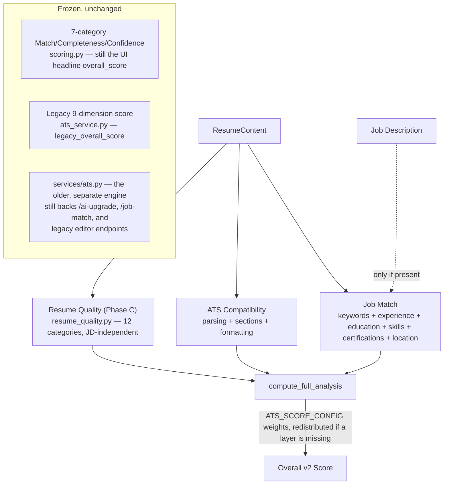

# SahiCareer ATS Intelligence 2.0

**Status of this document:** describes the system as it exists after Phase B + Phase C + Phase D + Phase E, verified directly against the code. Sections describing not-yet-built capability are explicitly marked **PLANNED**. See [ATS_CHANGELOG.md](ATS_CHANGELOG.md) for the change-by-change history and [ATS_PHASE_3_BACKUP.md](ATS_PHASE_3_BACKUP.md) for the pre-Phase-B snapshot this all builds on. See [PHASE_3_ATS_INTELLIGENCE.md](PHASE_3_ATS_INTELLIGENCE.md) for the original 7-category Match/Completeness/Confidence model, which is **unchanged** and still the canonical `overall_score`.

---

## 1. Architecture



**Two systems exist by design, not accident**, at three levels:
1. `services/ats.py` (oldest, frozen) vs `services/ats_engine/` (canonical) — see [PHASE_3_ATS_INTELLIGENCE.md](PHASE_3_ATS_INTELLIGENCE.md).
2. Within `ats_engine`: the 7-category model (`scoring.py`, drives `overall_score`, the UI headline) vs the 3-layer v2 model (`ats_intelligence_v2.py`, computed in parallel as `ats_intelligence_v2` in the API response, not yet the headline).
3. Within the v2 model: `analyze_v2()` (Phase B, frozen, `resume_quality` always excluded) vs `compute_full_analysis()` (Phase C, the general entry point with a real Resume Quality score) — both exist, both tested, both correct for their own callers.

## 2. Metrics & Formulas

### 2.1 ATS Compatibility (Layer 1)

| Category | Weight | Source |
|---|---|---|
| Parsing Quality | 53.3% | `parsing_quality.py` — 6 named metrics blended (see §2.5) |
| Section Recognition | 26.7% | `section_recognizer.py` — heading-variant tolerant |
| Formatting | 20% | reused from the frozen 7-category model's `_formatting_category()` |

Weights derived from `ATS_HEALTH_WEIGHTS` (§2.2) minus keyword coverage (JD-specific, lives in Job Match instead), renormalized.

### 2.2 Resume Health Score (Mode A — no JD, standalone)

```
ATS_HEALTH_WEIGHTS = { parsing: 40%, sections: 20%, keyword_coverage: 25%, formatting: 15% }
```
A separate, simpler 4-dimension model (`compute_resume_health_v2()`), inspired by the publicly documented general dimensions of ResumeGyani-style tools — SahiCareer's own implementation, not their algorithm. Distinct from the "no-JD" case of the 3-layer model (`compute_full_analysis(resume, None)`), which instead excludes Job Match and keeps Resume Quality.

### 2.3 Job Match (Layer 2)

```
JOB_MATCH_WEIGHTS = { keywords: 45%, experience: 22%, education: 12%, skills: 12%, certifications: 6%, location: 3% }
```
`experience`/`education` are reused unmodified from the frozen 7-category model (no keyword-matching risk there). `keywords`/`skills`/`certifications` are rebuilt on the alias-aware v2 matcher (§3). `location` is new — only applicable when the JD contains explicit location language (remote/hybrid/onsite/relocation/work authorization); otherwise excluded, weight redistributed.

### 2.4 Resume Quality (Layer 3 — Phase C)

```
QUALITY_WEIGHTS (renormalized from the spec's given values, which summed to 1.08):
  bullet_quality 16.7% · quantified_impact 13.9% · skill_evidence 13.9% ·
  summary_quality 9.3% · recruiter_readiness 9.3% · action_verbs 7.4% ·
  readability 7.4% · seniority 7.4% · career_progression 5.6% ·
  completeness 4.6% · repetition 2.8% · credibility 1.9%
```

Twelve categories, each a self-contained heuristic over the resume alone (no JD needed):

| Category | What it measures | Reuses |
|---|---|---|
| Bullet Quality | strong-verb openers, reasonable length, weak-phrase detection | — |
| Quantified Impact | real metrics (%, currency, counts) per bullet, never inventing one | — |
| Action Verb Strength | weak-opener detection (`responsible for`, `worked on`…) vs. a curated strong-verb list | — |
| Skill Evidence | does each listed skill appear in experience/projects/education text | `keyword_aliases._word_boundary_present` |
| Summary Quality | length, presence of generic filler phrases | — |
| Grammar & Readability | Flesch readability + spell/grammar issue density | `text_metrics.readability_score()`, `services/grammar.check_text()` |
| Seniority Signals | explicit ownership/leadership language — never inferred from title alone | — |
| Career Progression | title-rank sequence over time, gentle (not punitive) on step-downs | — |
| Content Completeness | overall profile fill-in | `scoring.profile_completeness()` |
| Repetition | near-duplicate bullets (Jaccard similarity) — does NOT penalize normal skill-keyword reuse across sections | — |
| Credibility | overlapping employment dates, implausible metrics — always phrased as "please verify," never accusatory | — |
| Recruiter Readiness | contact info + quantified-impact + action-verb composite | `text_metrics.recruiter_readiness_score()` |

### 2.5 Parsing Rate Engine

Six metrics, all computed from the same extracted `raw_text` every other module uses (no OCR, no PDF layout/bbox analysis):

- `parsed_character_ratio` — fraction of characters that aren't corruption markers (Unicode replacement char, control bytes)
- `parsed_word_ratio` — fraction of tokens that look like plausible words, not jammed-together or stray-character artifacts
- `garbled_text_ratio` — same odd-token heuristic as the pre-existing `formatting_score()`, surfaced as its own explicit metric
- `section_extraction_ratio` — delegated to the Section Recognition engine
- `reading_order_score` — **heuristic proxy only**: checks whether Summary appears before Experience/Education (a mild disorder signal) and whether there's a run of very-short consecutive lines (a flat-text signature of multi-column extraction). Not true layout analysis.
- `contact_extraction_score` — email/phone found, and found near the top of the document

### 2.6 Section Recognition Engine

Heading-variant tolerant — recognizes e.g. "Employment History"/"Work History"/"Career History" as Experience. Core sections (Summary, Experience, Education, Skills) are "expected" and penalized if absent; optional sections (Projects, Certifications) are recognized but never penalized for being missing.

## 3. Keyword Matching — the alias-aware v2 matcher

`keyword_aliases.py`, used only by the v2 layers (the frozen 7-category model keeps its own, older matcher — see §7).

**Documented bug it fixes** (verified empirically, not assumed): the old matcher's fuzzy fallback, `rapidfuzz.fuzz.token_set_ratio`, scores `"react"` vs `"react native"` as **100.0** — a false match. The fix: switch to plain `fuzz.ratio` (length-sensitive, doesn't inflate on token-subset containment) at the same 85 threshold — verified this alone fixes the false positive while still catching genuine variants (`framework`/`frameworks` = 94.7).

**Curated alias table** (~20 entries, deliberately small and honest — not exhaustive) handles abbreviations `ratio` alone can't catch due to length mismatch: JS↔JavaScript, TS↔TypeScript, AWS↔Amazon Web Services, Node↔Node.js, React↔ReactJS, Postgres↔PostgreSQL, K8s↔Kubernetes, and others.

**Boundary-safe substring matching** — a manual character-scan (not regex lookaround) so "C" doesn't match inside "C++"/"C#", while "C++" still matches itself, and a term immediately before a sentence-ending period still matches correctly (an early regex-based attempt got this specific case wrong — caught and fixed before shipping, see [ATS_CHANGELOG.md](ATS_CHANGELOG.md) Phase B entry).

## 4. Match / Completeness / Confidence

Every category across every layer — the original 7, the new Job Match 6, the new Resume Quality 12, the ATS Compatibility 3 — returns the same shape:

```
{ key, label, applicable, match (0-100 or null), completeness (0-100), confidence, matched_evidence, missing_evidence, reason, weight }
```

Confidence thresholds (identical everywhere in the system):
```
no signal          → low
completeness ≥ 70   → high
completeness ≥ 35   → medium
completeness < 35   → low
```

## 5. Weight Redistribution

Applied at **two levels**, same rule both times: a category/layer that's `applicable=False` or has `match=None` is excluded entirely and its weight is redistributed proportionally across whatever remains usable — never scored as zero.

- **Within a layer** — e.g. Job Match excludes `education` when the JD states no requirement; ATS Compatibility excludes nothing in practice (all three of its categories are always computable from text alone).
- **Across the three layers** — Resume Quality is always computable (JD-independent); Job Match is excluded when no JD is supplied. `analyze_v2()` (Phase B) always excludes Resume Quality (not implemented at that point); `compute_full_analysis()` (Phase C) never does.

## 6. AI Integration & Cost Discipline

Deterministic-first, same principle as the original 7-category model: every Resume Quality category, the Parsing Rate engine, and Section Recognition are **100% deterministic Python** — zero LLM calls. The only AI-touching path in the v2 layers is Responsibility matching (reused unmodified from the frozen model), which itself degrades to token-overlap with no embedding key configured. `compute_full_analysis()` makes no new AI/embedding calls beyond what the existing pipeline already made for `overall_score`.

## 7. What Stays Frozen (and why)

| Frozen | Why |
|---|---|
| `scoring.py`'s 7 categories, `CATEGORY_WEIGHTS`, `_redistribute_weights()` | Still drives `overall_score`, the UI headline — changing it was explicitly out of scope for both phases |
| `keyword_engine.py` (`match_lists()`, the `token_set_ratio` matcher) | Still used by the frozen 7-category model; the documented false-positive bug in it is deliberately NOT fixed in place — a new, parallel matcher was built instead, so the old model's tested behavior never changes |
| `services/ats.py` (the older, separate engine) | Still backs `/ai-upgrade`, `/job-match`, and (until fully migrated) parts of the resume editor |
| `analyze_v2()` (Phase B's entry point) | Its own tests assert `resume_quality` is always excluded there — `compute_full_analysis()` is the new function for anyone who wants a real Resume Quality score |

## 8. Editor Integration

`POST /api/ats/v2/analyze-editor` — one endpoint covering both of the Resume Editor's call patterns (debounced no-JD auto-analysis, and manual JD-based scoring). See [ATS_CHANGELOG.md](ATS_CHANGELOG.md) for the exact request/response shape and persistence rule (report saved only when a JD is supplied, matching the legacy endpoints' existing write frequency). Legacy `/api/ats/analyze`/`/api/ats/score` are untouched and still work — this is an additive migration of the frontend caller, not a backend removal.

## 9. Debug Mode

`build_debug_breakdown()` — opt-in via `"debug": true` in the request. Returns, per category, per layer: raw score, weight, weighted contribution, completeness, confidence, evidence, and excluded-reason (when applicable). Not sent by default; the editor doesn't render it yet (no UI built for it this phase — the data exists for future admin/debug tooling).

## 10. Live Scoring & Score History — **IMPLEMENTED (Phase D)**

`ats_change_history` (table, Phase B) now has a real writer. Every apply and every undo writes its own row (`apply_fix.py`) with `before_score`, `after_score`, `score_delta`, and `changed_metrics` (per-layer deltas) — computed **fresh, through the real engine, from actual old/new resume content**, never estimated and never read back from the `AtsReport`'s persisted 7-category shape (which doesn't carry the v2 3-layer breakdown). `GET /api/ats/v2/resumes/{resume_id}/change-history` returns the full list, newest first; `POST /api/ats/v2/change-history/{history_id}/undo` restores the previous content and writes a **new** history row (action_type=`undo`) rather than deleting or editing the old one — history is append-only.

## 11. AI Recommendation / Optimization Agent — **IMPLEMENTED (Phase D)**

The full recommendation → approval → apply → reparse → rescore → delta → history loop, built on top of Phase C's deterministic findings (`build_editor_recommendations()`), never replacing them.

**Two-stage design** (performance discipline — AI is never called in bulk or on every keystroke):
- **Stage 1 — `ai_recommendations.classify_and_stage()`** (deterministic, no AI call). Every deterministic recommendation from `build_editor_recommendations()` now carries `source_layer`/`source_category` attached directly at creation time (not guessed back from text — see the misclassification bug in [ATS_CHANGELOG.md](ATS_CHANGELOG.md)). Mapped to one of 13 controlled `action_type`s (`ATS_ACTION_TYPES` in `models.py`), a priority, and whether it needs new evidence from the user. Persisted as `AtsRecommendation` rows — one per finding — only in the JD-based analysis path (same persistence discipline as `AtsReport` itself).
- **Stage 2 — `ai_recommendations.generate_proposal()`** (async, calls the AI, lazily, one recommendation at a time — never in bulk). Uses `services/ai.py::_chat()` (Gemini-first → OpenAI fallback → `None`), the same provider abstraction the rest of the app uses — **not** `enhance_bullet()`/`generate_summary()`, whose prompts allow "if possible" fabrication; Phase D's prompts explicitly forbid inventing any fact not already present.

**Evidence tiers** (`ATS_EVIDENCE_TIERS`): `verified` (user-confirmed fact) · `inferred` (reword of existing facts, no new claim) · `suggested` (deterministic finding, no AI proposal yet) · `unknown` (missing, a question is pending). Action types split three ways:
- **Reword-only** (`improve_bullet`, `improve_readability`, `remove_repetition`) — AI may rewrite immediately, but only reusing facts already in the text.
- **Needs evidence** (`quantify_bullet`, `add_keyword`, `add_skill_evidence`, `improve_skills`) — a deterministic question is generated (`_build_question()`); no proposal exists until the candidate answers (`POST /recommendations/{id}/answer`). For `add_keyword`/`add_skill_evidence`/`improve_skills` the "proposal" is the candidate's own confirmed words, recorded verbatim — no AI rewrite is auto-generated for these (would risk overstating a skill).
- **Structural** (`fix_section`, `fix_formatting`) — informational only, never auto-applied, never AI-proposed (Part 24: formatting changes are opt-in only).

**Recommendation lifecycle** (`AtsRecommendation.status`): `pending → answered (if evidence needed) → approved (preview generated) → applied` or `→ rejected` at any point before `applied`. `target_text` (the exact verbatim text to locate and replace) is captured **once**, at staging time (`_extract_target_text()`), not re-derived from `title`/`reason` strings at apply time — an earlier version tried the latter and silently mis-targeted content (see [ATS_CHANGELOG.md](ATS_CHANGELOG.md)).

**Apply flow** (`apply_fix.apply_recommendation()`, `POST /recommendations/{id}/apply`):
1. Optimistic-concurrency claim: a conditional `UPDATE ... WHERE status != 'applied'`, checked via `rowcount`, so a genuine double-click or two near-simultaneous requests can't both succeed (residual race for truly simultaneous requests is a documented, not fully closed, limitation — see §14).
2. Staleness check (`check_staleness()`): `AtsRecommendation.resume_updated_at_snapshot` (captured when the recommendation was staged) vs. `resume.updated_at` right now. Mismatch → `StaleRecommendationError` → HTTP 409, "This recommendation is based on an older version of your resume. Re-analyze before applying."
3. Locate the exact verbatim `target_text` in the current content (bullet or summary) and replace it — or add a skill, for evidence-confirmed skill/keyword recommendations. Text-matching (not index paths) is naturally staleness-aware: if the surrounding content shifted, the exact string usually still matches; if it genuinely doesn't exist anymore, `TargetNotFoundError` → HTTP 409.
4. Both the "before" and "after" score are computed **fresh**, through `compute_full_analysis()`, from the actual old and new resume content (`ResumeParser.from_content(...)` on each) — never `old_score + estimate`.
5. Writes one `AtsChangeHistory` row (`before_content`, `after_content`, `before_score`, `after_score`, `score_delta`, `changed_fields`, `changed_metrics` = per-layer deltas, `user_approved=True`, `scoring_engine_version`) and flips the recommendation to `applied`. Reuses `routers.resumes._apply_content`/`_to_content`/`_snapshot`/`_load_full` — explicit, documented reuse of the router's content-decomposition helpers (same precedent as `routers/ats_engine.py`'s existing `_resume_to_content`), to avoid a second, divergent implementation of "how resume content sections map to stored fields."
6. On any failure mid-flow (DB write, content apply), the transaction is rolled back — no partial/inconsistent state, verified by `test_transaction_failure_leaves_no_inconsistent_state` (monkeypatches the content-apply step to raise).

**Undo** (`apply_fix.undo_change()`, `POST /change-history/{history_id}/undo`) mirrors apply exactly: restores `before_content` from the chosen history row, rescopes before/after fresh from real content, and writes a **new** history row (`action_type="undo"`) rather than mutating the original — the audit trail never loses a step.

**Anti-gaming** (`anti_gaming.py`) — `detect_keyword_stuffing()` (≥6 repetitions of a term), `detect_jd_copying()` (12-word longest-match against the JD via `difflib.SequenceMatcher`), `detect_stuffed_keyword_blocks()`. This is **detection/flagging**, not score suppression — the v2 matcher is a binary found/missing signal, so it's already structurally immune to score inflation from repetition; anti-gaming exists to warn the user their edit looks like stuffing, not to punish the score twice. `generate_proposal()` checks `is_term_overused()` before proposing to add a keyword the resume already repeats unusually often, and declines with an explanation instead.

**Minimal editor UI** (Phase D, `frontend/app/resumes/[id]/edit/page.tsx`) — a fourth right-panel tab, "AI Fixes," showing the live recommendation list (question/answer for evidence-needing types, preview with an editable before/after for reword types), Apply/Dismiss actions, and a Change History list with per-entry Undo. Applying reloads the resume content from the server (never assumes the AI's proposal is what got saved — `final_content` may have been hand-edited) and shows the real before→after score delta inline. This is additive to the existing Insights/AI Assistant/Skill Gap tabs, not a redesign of them.

## 12. Benchmark Methodology & Competitor Comparison — **IMPLEMENTED (Phase E)**

A hand-built, hand-labeled benchmark corpus (`backend/tests/fixtures/benchmark_dataset.py`) — 12 resumes (3 industries × 4 seniority bands) × 9 JDs (3 per industry: same-level, senior/lead, and an "adjacent" JD requiring a genuinely different, non-overlapping tool stack) = 36 resume × JD pairs, plus 6 Resume Quality strong/weak writing probes, 5 Parsing Rate anti-pattern probes, and 6 anti-gaming probes — run through the real production engine by `backend/scripts/run_benchmark.py`, producing `docs/ATS_BENCHMARK_REPORT.md`.

**What this checks — and explicitly does not check:** whether the engine detects what the hand-labels say it should (keyword presence/absence, resume-quality direction, parsing-quality direction, anti-gaming flags) — never a comparison against Enhancv/ResumeGyani/Zety's actual output, since no such data exists or is collected anywhere in this codebase. `docs/ATS_BENCHMARK_REPORT.md`'s competitor-comparison section is explicitly marked **NOT AVAILABLE**, not estimated — per the same "never tune to match a competitor" rule `ats_config.py` has documented since Phase B.

**Hard vs. informational, by design** (see `test_ats_benchmark.py`'s own module docstring for the full policy): keyword false-positive safety, alias correctness (the documented React/React Native-class regression), missing-data-never-zero, weight redistribution, score determinism, Resume Quality/Parsing Rate direction, and anti-gaming detection are all **hard** regression tests (69 total, `backend/tests/test_ats_benchmark.py`) — true by construction, a failure is a real defect. Keyword recall, match-band accuracy, and adjacent-mismatch-ordering pass rate are **informational** — floored generously against a catastrophic regression, not held to a strict per-case bar, because their ground truth is a hand-guess about the full blended formula, not a construction guarantee.

**Calibration candidates are documented, not fixed.** Phase E's own policy: a benchmark finding gets written up (finding / evidence / affected metric / possible cause / confidence / recommended action) in `docs/ATS_BENCHMARK_REPORT.md`'s "Calibration Candidates" section — it does not trigger an in-phase `ats_config.py` change. One candidate was documented this phase (Job Match may under-discriminate clearly-mismatched candidates when a JD leaves `min_experience_years`/`min_education` unset — MEDIUM confidence, INFERRED, not confirmed) — no scoring code was changed as a result.

## 13. Anti-Gaming Rules — **IMPLEMENTED (Phase D)**

See §11. `anti_gaming.py`: keyword-stuffing detection, JD-copying detection, stuffed-keyword-block heuristic — flagged to the user, not silently score-punished. Resume Quality's `repetition` category (Phase C, near-duplicate *bullets*) remains a separate, related concern.

## 14. Limitations (honest, not deferred silently)

- `reading_order_score`/`contact_extraction_score` are heuristic proxies computed from flat extracted text — no true PDF layout/geometry analysis.
- The alias table (~20 entries) is deliberately small, not an exhaustive technology dictionary — new false negatives should be added to it as found, not solved by loosening the fuzzy threshold (which is exactly what caused the original bug).
- `_readability_category`'s grammar signal uses `services/grammar.py`'s curated-allowlist spell checker, which can still occasionally flag valid resume-specific terms — confidence is deliberately capped at "medium," never "high," for this reason.
- Career Progression and Seniority Signals are language-pattern heuristics, not a real understanding of role scope — they're explicitly designed to never penalize absence of language (a fresher resume with no leadership language isn't marked "bad," just "no signal found").
- The ATS Checker page (`/ats-checker`) still shows only the legacy 7-category score — the 3-layer v2 score and the Phase D AI Fixes loop are surfaced in the Resume Editor only, per Phase C/D's explicit scope (not a full-app rollout).
- **Phase D concurrency**: the optimistic-concurrency `UPDATE ... WHERE status != 'applied'` closes the common double-click case but is not true row-level locking — two requests arriving in the same DB round-trip window could theoretically both pass the initial read-check before either commits its claim. Documented, not yet hardened; low real-world likelihood (a single user, two tabs, clicking the same Apply button within milliseconds).
- **Phase D apply/undo latency**: both recompute the full 3-layer score twice (before + after) through the real engine — by design, since estimated deltas were explicitly disallowed. Observed ~2–13s per apply/undo in this environment depending on AI-provider round-trip and grammar-check cost; acceptable for an explicit, user-initiated action, but a candidate for caching/optimization if it becomes a UX complaint.
- **Phase D local test coverage**: 13 of the 63 Phase D tests are DB-integration tests that require the local test Postgres (`localhost:5432`); that database was not reachable in the sandboxed session Phase D was built in, so those 13 could not be locally executed there (pytest collects them without error). The identical flows were separately verified against the real dev Supabase database via a live, manual end-to-end script — see [ATS_CHANGELOG.md](ATS_CHANGELOG.md) Phase D entry.

## 15. Test Strategy

| Suite | Count | Covers |
|---|---|---|
| `test_ats_engine.py` | 30 | The original 7-category model (Phase 3, untouched) |
| `test_ats_intelligence_v2.py` | 56 | Phase B: alias matcher, config, parsing/section engines, layer aggregation |
| `test_phase_c_resume_quality.py` | 59 | Phase C: all 12 Resume Quality categories, `compute_full_analysis()`, editor recommendation/question/debug builders, and regression guards proving `analyze_v2()`'s Phase B contract is still frozen |
| `test_phase_d_ai_agent.py` | 63 | Phase D: anti-gaming detectors, recommendation classification/staging, AI proposal generation (anti-fabrication, evidence tiers), apply/undo pure helpers, staleness detection, and (13 tests, DB-integration, environment-blocked locally — see §14) the full persisted-recommendation → apply → rescore → history → undo lifecycle, concurrency, ownership, and transaction-safety |
| `test_ats_benchmark.py` | 69 | Phase E: hand-labeled benchmark corpus (36 pairs, 12 resumes) run through the real engine — dataset integrity, keyword false-positive safety (hard), alias-correctness regressions (hard), missing-data-never-zero (hard), weight redistribution (hard), score determinism (hard), Resume Quality/Parsing Rate direction (hard), anti-gaming detection (hard), keyword recall/band-accuracy/adjacent-ordering (informational, floored against catastrophic regression only) |

Every new category has both a positive case (real signal detected) and a negative/edge case (missing data → N/A, never zero). Several bugs were caught by this suite and by live E2E testing before reaching a live response (see [ATS_CHANGELOG.md](ATS_CHANGELOG.md)) — the test suite is treated as load-bearing, not decorative.
